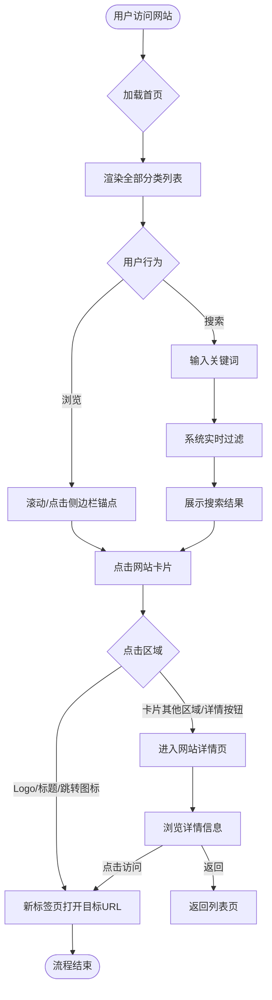

# 思想理论导航网站 (Theory Navi) - 产品需求文档 (PRD)

| 文档版本 | V1.0 |
| :--- | :--- |
| **文档状态** | Draft |
| **作者** | Antigravity |
| **最后更新日期** | 2026-02-04 |

---

## 1. 项目概述 (Project Overview)

### 1.1 项目背景 (Background)
- **问题陈述**：思想理论工作者（学者、研究员）和学习者（学生、爱好者）在日常工作中经常需要访问各类学术机构、理论刊物、档案馆和数据库网站。目前这些资源分散且缺乏系统的整理，用户往往依赖这就杂乱的书签或搜索引擎，效率低下。
- **解决方案**：构建一个专注于“思想理论”领域的垂直导航网站，汇集高质量的理论资源站点，提供分类展示和便捷搜索功能。
- **目标用户**：高校师生、社科院研究员、理论宣传工作者、思想理论爱好者。

### 1.2 核心价值 (Value Proposition)
- **用户价值**：
    - **高效获取**：一站式直达高频使用的理论网站，节省检索时间。
    - **资源发现**：通过分类浏览发现同领域未知的优质资源。
    - **极简体验**：无广告、无干扰，适合作为浏览器首屏，提供专注的学术环境。
- **业务价值**：
    - 打造思想理论领域的流量入口。
    - 沉淀垂直领域的高质量链接数据。

### 1.3 适用范围 (Scope)
- **终端覆盖**：
    - **Web端 (核心)**：适配主流桌面浏览器 (Chrome, Edge, Safari, Firefox)，作为主力使用场景。
    - **移动端 (H5)**：适配手机浏览器，满足临时查阅需求。
- **版本规划**：
    - **V1.0 (MVP)**：核心导航功能（分类展示） + 搜索功能。
    - **V1.1 (规划中)**：用户自定义（收藏、排序）、夜间模式、资源提交入口。

---

## 2. 用户分析与场景 (User & Scenario Analysis)

### 2.1 用户角色 (User Personas)

| 角色名称 | 特征描述 | 核心诉求 | 使用频率 |
| :--- | :--- | :--- | :--- |
| **理论研究员 (老张)** | 45岁，某社科院研究员，电脑操作基础，习惯固定 | 快速打开常用的CNKI、人民日报理论版、特定数据库 | 每日多次 (浏览器首页) |
| **马哲研究生 (小李)** | 24岁，硕士在读，喜欢探索新知识 | 寻找特定主题（如西方马克思主义）的相关网站，做文献综述 | 每周 2-3 次 |

### 2.2 核心使用场景 (Key Scenarios)

> **场景1：日常办公启动**
> **When**：老张早上来到办公室，打开浏览器。
> **Why**：准备开始一天的工作，需要查看最新的理论动态。
> **What**：浏览器自动打开“思想理论导航”首页，他直接点击“中央级媒体”分类下的“求是网”开始阅读。

> **场景2：专题资料查找**
> **When**：小李正在写一篇关于“政治经济学”的论文。
> **Why**：需要查找相关的专业数据库或研究机构网站。
> **What**：在导航站搜索框输入“政治经济学”，系统实时筛选出相关网站，小李依次点击并在新标签页中浏览。

### 2.3 业务流程图 (Business Flow)



---

## 3. 功能详细设计 (Functional Requirements)

### 3.1 首页导航展示 (Navigation Display)

#### 3.1.1 用户故事
```
作为 一名理论工作者
我想要 看到清晰分类的网站列表
以便于 我能快速找到我需要的某一类资源（如“党刊党建”、“学术期刊”）
```

#### 3.1.2 前置条件
- 系统已预置配置好的网站数据（JSON/数据库）。

#### 3.1.3 页面设计 (UI Design)

**页面布局示意**：
```
```
┌──────────────────────────────────────────────────────────────┐
│  [Logo] 思想理论导航                     [关于我们] [提交收录] │
├──────────────┬───────────────────────────────────────────────┤
│ [侧边栏导航] │                                               │
│  • 马列经典  │          [      请输入关键词搜索...      ] 🔍 │
│  • 党报党刊  │                                               │
│  • 学术机构  │  [分类标题：马列经典]                         │
│  • 国外思潮  │  ┌──────────────┐  ┌──────────────┐           │
│              │  │ [图标] 网站A │  │ [图标] 网站B │           │
│              │  └──────────────┘  └──────────────┘           │
│              │                                               │
│              │  [分类标题：党报党刊]                         │
│              │  ┌──────────────┐  ┌──────────────┐           │
│              │  │ ...          │  │ ...          │           │
│              │  └──────────────┘  └──────────────┘           │
│              │                                               │
└──────────────┴───────────────────────────────────────────────┘
```
```

**界面元素清单**：

| 元素名称 | 类型 | 说明 | 必填 | 数据来源 | 交互效果 |
| :--- | :--- | :--- | :--- | :--- | :--- |
| **侧边栏分类** | 列表 | 点击可快速定位到右侧对应锚点 | 是 | Category List | 高亮当前所在区域分类 |
| **网站卡片** | 容器 | 包含图标、名称；**统一固定大小** | 是 | Site Data | Hover时轻微上浮/阴影加深 |
| **网站名称** | 文本 | 网站的主标题；**过长截断** | 是 | Site Name | **Hover时悬浮显示完整名称** |
| **网站链接** | 链接 | 点击跳转区域 | 是 | Site URL | 点击后 `target="_blank"` 打开 |

#### 3.1.4 交互逻辑
1.  **左侧分类点击**：
    *   点击左侧某个分类（如“学术机构”），右侧内容区域平滑滚动至该分类标题处。
    *   **滚动监听**：当用户手动滚动右侧内容时，左侧对应分类自动高亮。

2.  **网站卡片点击**：
    *   **直接访问**：点击卡片右上角的“跳转图标”或网站标题，直接在新标签页打开目标 URL。
    *   **查看详情**：点击卡片其他区域（或专门的“详情”按钮），进入**网站详情页**。
    *   **查看详情**：点击卡片其他区域（或专门的“详情”按钮），进入**网站详情页**。

---

### 3.2 网站详情页 (Site Detail)

#### 3.2.1 用户故事
```
作为 一名研究生
我想要 查看网站的详细介绍和相关标签
以便于 在跳转前判断该网站是否符合我的研究需求（例如是否包含特定时期的历史档案）
```

#### 3.2.2 页面设计 (UI Design)

**页面布局示意（嵌入在主框架中）**：
```
┌──────────────────────────────────────────────────────────────┐
│  [Logo] 思想理论导航                     [关于我们] [提交收录] │
├──────────────┬───────────────────────────────────────────────┤
│ [侧边栏导航] │ [ < 返回 ]                                    │
│  • 马列经典  │                                               │
│  • ...       │       ┌──────────┐                            │
│              │       │          │   网站名称：求是网         │
│              │       │   LOGO   │   Category: 党刊党建       │
│              │       │          │   [ 🌐 立即访问 ]          │
│              │       └──────────┘                            │
│              │                                               │
│              │  ────── 详细介绍 ───────────────────────────  │
│              │                                               │
│              │  求是网是中国共产党中央委员会机关刊《求是》   │
│              │  杂志主办的理论宣传平台...                    │
│              │                                               │
│              │  ────── 标签/属性 ──────────────────────────  │
│              │                                               │
│              │  [权威媒体] [政治理论] [全文检索]             │
│              │                                               │
└──────────────┴───────────────────────────────────────────────┘
```

**界面元素清单**：

| 元素名称 | 类型 | 说明 | 必填 | 交互效果 |
| :--- | :--- | :--- | :--- | :--- |
| **返回按钮** | 按钮 | 位于内容区顶部，点击返回上一级列表页 | 是 | - |
| **大图标/Logo** | 图片 | 高清网站标识 | 是 | - |
| **详细描述** | 文本 | 完整介绍，支持富文本或Markdown渲染 | 否 | - |
| **访问按钮** | 按钮 | 醒目的CTA按钮 | 是 | Hover变色，点击外链跳转 |
| **标签 (Tags)** | 列表 | 如“数据库”、“免费”、“需校内网” | 否 | 点击可搜索同标签网站 |

#### 3.2.3 交互逻辑
1.  **进入方式**：通过首页列表的卡片触发（可以是弹窗 Modal 形式，也可以是路由跳转的新页面，MVP 建议使用 **路由跳转的新页面** 以利于 SEO 和 URL 分享）。
2.  **立即访问**：点击“立即访问”按钮，`target="_blank"` 打开目标网站。
3.  **标签点击**：点击标签（如“免费”），跳转回首页并自动执行该标签的搜索/筛选。


---

### 3.3 关键词搜索 (Keyword Search)

#### 3.3.1 用户故事
```
作为 一名学习者
我想要 通过关键词搜索网站
以便于 不需要遍历所有分类就能找到特定网站
```

#### 3.3.2 页面设计 (UI Design) - 搜索状态

**页面布局示意**：
```
┌──────────────────────────────────────────────────────────────┐
│  [Logo] 思想理论导航                     [关于我们] [提交收录] │
├──────────────┬───────────────────────────────────────────────┤
│ [侧边栏导航] │                                               │
│  • 马列经典  │   [      马哲      ] 🔍   [取消搜索]          │
│  • ...       │                                               │
│              │  搜索 "马哲" 的结果 (共 3 条)                 │
│              │                                               │
│              │  ┌──────────────────────────┐  ┌───────────┐  │
│              │  │ [图标] 西方*马哲*研究会  │  │ ...       │  │
│              │  │    ...国内专业的...      │  │           │  │
│              │  │ Category: 学术机构       │  │           │  │
│              │  └──────────────────────────┘  └───────────┘  │
│              │                                               │
└──────────────┴───────────────────────────────────────────────┘
```

#### 3.3.3 交互逻辑
1.  **输入触发**：
    *   用户在搜索框输入文字。
    *   **防抖 (Debounce)**：输入停止 300ms 后触发搜索逻辑。

2.  **匹配规则**：
    *   匹配范围：`网站名称` OR `网站描述` OR `网站分类`。
    *   匹配方式：不区分大小写，支持模糊匹配。

3.  **结果展示**：
    *   **有结果**：
        *   隐藏原有的分类试图（或在当前视图中仅保留匹配项）。
        *   高亮匹配的关键词（如输入 "求是"，结果中 "求是" 变红）。
    *   **无结果**：
        *   显示空状态插画。
        *   文案：“未找到与 'xxx' 相关的网站，建议简化关键词或[提交收录]”。

---

## 4. 异常流程与边界情况 (Exception Handling)

### 4.1 数据异常
| 场景 | 用户表现 | 系统行为 | 恢复/处理方式 |
| :--- | :--- | :--- | :--- |
| **网站图标加载失败** | 网站Logo显示“破碎”图标 | 显示默认的占位图标（如首字生成的Avatar或通用地球图标） | 保持界面整洁，不影响点击 |
| **数据源加载失败** | 首页空白或一直Loading | 显示全屏错误页：“资源加载失败，请检查网络” | 提供“刷新”按钮 |
| **没有网站数据** | 搜索结果为空 / 初始数据为空 | 显示空状态页 | 引导用户[推荐网站] |

### 4.2 交互边界
- **超长文本**：
    - 网站名称过长（卡片）：限制单行，超出部分截断显示 `...`，鼠标悬停 (Hover) 显示完整名称。
    - 描述过长（详情页）：限制行数，超出部分显示 `...`。
- **特殊URL**：
    - 只有 IP 地址的 URL：正常解析跳转。
    - 非 HTTP/HTTPS 协议：前端校验，若非合法协议则在点击时提示“链接格式无效”。

---

## 5. 非功能性需求 (Non-functional Requirements)

### 5.1 性能要求 (Performance)
- **首屏时间 (FCP)**：< 1.5s（作为浏览器首页，速度至关重要）。
- **资源体积**：Gzip 后 CSS+JS < 200KB（不含图片）。
- **图片优化**：网站图标使用 LazyLoad，优先使用 WebP 格式或 SVG。

### 5.2 兼容性 (Compatibility)
- **浏览器**：Chrome 80+, Safari 13+, Firefox 70+, Edge (Chromium内核)。
- **响应式**：
    - Desktop: 1200px+ (三栏/四栏布局)
    - Tablet: 768px - 1199px (两栏/三栏布局)
    - Mobile: < 768px (单栏布局，侧边栏转为顶部水平滚动或抽屉菜单)

### 5.3 数据维护性
- 网站数据应独立于代码（如 `data.json` 或 `sites.ts`），便于非技术人员（或通过简单脚本）进行更新这一配置。

### 5.4 Web端技术栈选型 
- **前端框架**: Next.js (React) - *理由：优秀的服务端渲染(SSR)和静态生成(SSG)能力，利于SEO，首屏加载速度极快*。
- **开发语言**: TypeScript - *理由：提供类型安全，便于维护复杂的数据结构和组件状态*。
- **样式方案**: CSS Modules / Vanilla CSS - *理由：无额外运行时开销，易于定制“党政风”的细节样式，符合简约要求*。
- **图标库**: Lucide React - *理由：风格中性简约，线条流畅，完美适配 React/Next.js，支持 Tree-shaking，体积小*。
- **部署环境**: Vercel / Netlify / 静态Web服务器 (Nginx) - *理由：支持自动化部署，运维成本低*。
- **数据源**:  如果没有后端接口，基于用户提供的数据源或构造mock数据；实现时要抽象数据层，以便将来对接其他数据源或API接口。

---

### 6. 待确认事项 (Open Questions) - **已确认/Resolved**

1.  **数据来源维护**：
    *   **决议**：数据来源为静态文件（JSON/Markdown/Excel）。V1.0 暂不开发后台管理系统，直接维护配置文件。
2.  **统计需求**：
    *   **决议**：**不需要统计功能**。V1.0 不接入 PV/UV 统计，也不统计外链点击量。
3.  **UI 风格偏好**：
    *   **决议**：**简约学术，党政风格**。色彩以红/金/白/黑为主，排版严谨，强调官方权威感，避免过度花哨的动效。

---

## 7. 附录 (Appendix)

### 7.1 数据结构示例 (Draft Data Structure)

```typescript
interface Site {
  id: string;
  name: string;      // 网站名称，如 "求是网"
  url: string;       // 跳转链接
  description: string; // 简介
  category: string;    // 分类，如 "党刊党建"
  tags: Array;   // 标签
  icon?: string;       // 图标地址 (可选)
  rank?: number;       // 排序权重 (可选)
}
```

### 7.2 变更记录 (Change Log)

| 日期 | 版本 | 修改内容 | 修改人 |
| :--- | :--- | :--- | :--- |
| 2026-02-04 | V1.0 | 初始版本创建：定义分类展示与搜索功能 | Antigravity |
| 2026-02-04 | V1.1 | 增加网站详情页功能设计 | Antigravity |
| 2026-02-04 | V1.2 | 补充搜索结果页面 ASCII 示意图 | Antigravity |
| 2026-02-04 | V1.3 | 调整布局，侧边栏贯通顶部，包含搜索区 | Antigravity |
| 2026-02-04 | V1.4 | 详情页保留整体框架，移除相关推荐 | Antigravity |
| 2026-02-04 | V1.5 | 明确数据源为文件，移除统计需求，定调UI为简约党政风 | Antigravity |
| 2026-02-04 | V1.6 | 补充前端技术栈选型 (Next.js + TS) | Antigravity |
| 2026-02-04 | V1.7 | 确认图标库选型 (Lucide React) | Antigravity |
